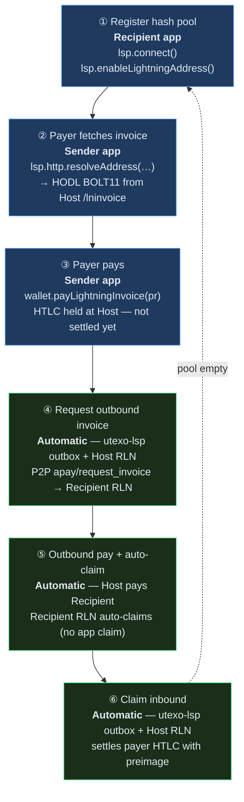

# Async Payments (APay)

Async payments let a recipient receive Lightning while **offline at payment time**. The recipient pre-registers a **hash pool** with an always-online **Host RLN** (LSP node). Payers use a stable **Lightning Address** (`username@domain`); each payment gets a fresh HODL BOLT11.

**Protocol spec:** [Async Payments — RGB Lightning Node & Utexo LSP](https://hackmd.io/@xalkan/async-payments)

**Working demo:** [rgb-sdk-web-demo — LSP & APay page](https://github.com/UTEXO-Protocol/rgb-sdk-web-demo) (`src/components/apay/useApayFlow.ts`)

---

## Roles

| Role | Component | Your app calls it? |
|------|-----------|-------------------|
| Recipient | Recipient RLN in the browser | Yes — register pool, **`lsp.connect()` while online** |
| Host | LSP's RLN node | No — P2P + HTTP to utexo-lsp |
| Orchestrator | utexo-lsp | Partial — LNURL + discovery HTTP only |
| Payer | Sender RLN in the browser | Yes — LNURL + pay + poll send status |

> **Important:** APay settlement is **automatic**. When the LSP outbox pays the recipient's outbound invoice, the recipient node auto-claims. Your app calls `lsp.connect()` while online and polls for `Succeeded`. See [Lightning Address vs HODL invoice](#lightning-address-vs-hodl-invoice) below.

---

## Six-step flow



| Step | What happens | Who drives it | SDK call |
|------|-------------|---------------|----------|
| **①** | Address provisioned on connect; attested hash batch stored | **Recipient app** | `lsp.connect()` → `lsp.enableLightningAddress()` |
| **②** | Hash slot reserved; inbound HODL BOLT11 from Host | **Sender app** | `lsp.http.resolveAddress(username, amtMsat, assetId?, assetAmount?)` |
| **③** | Payer pays BOLT11; inbound HTLC held at Host | **Sender app** | `lsp.waitForOutboundLiquidity(…)` then `wallet.payLightningInvoice(…)` |
| **④** | Outbox asks Recipient for outbound invoice over P2P | **Host + utexo-lsp** | Recipient must be reachable — **`lsp.connect()`** |
| **⑤** | Host pays outbound invoice; Recipient **auto-claims** | **Host + Recipient RLN** | App: optional `listPaymentsRaw()` → `InboundHodl`/`Succeeded` |
| **⑥** | Host settles payer HTLC with preimage | **Host + utexo-lsp** | App: poll `getLightningSendRequest(hash)` → `Settled` |

**Blue steps (①②③)** — your app. **Green steps (④⑤⑥)** — LSP outbox; the recipient app keeps **`lsp.connect()`** alive when online.

When `unusedHashes` runs low, call `lsp.refillHashPool()` to register a fresh attested batch.

---

## SDK usage

### Wallet + LSP setup

```typescript
import { UTEXOWallet } from '@utexo/rgb-sdk-web';

const wallet = await UTEXOWallet.create({
  mnemonic,
  password: 'my-secure-password',
  network: 'utexo',
  lspBaseUrl: 'https://lsp.utexo.com',
  lspBearerToken: 'bearer-token',
});

// No-arg: discovers pubkey from lspBaseUrl + GET /get_info,
// host from the URL hostname, port 9735.
const lsp = await wallet.createLsp();
```

**Regtest local stack** (non-standard LDK peer port):

```typescript
const wallet = await UTEXOWallet.create({
  mnemonic,
  password,
  network: 'regtest',
  lspBaseUrl: 'http://127.0.0.1:8080',   // or a dev-proxy path like '/lsp'
  lspBearerToken: 'dev-token',
});

const lsp = await wallet.createLsp(undefined, 9745);  // regtest LDK port ≠ default 9735
```

An explicit `LspPeer` + `createLsp(peer)` is still valid when you cannot set `lspBaseUrl` on the wallet.

### ① Recipient — register + Lightning Address

Both sides need an RGB channel first: `lsp.connect()` → `lsp.waitForChannel(assetId, { … })`.

```typescript
await lsp.connect();  // connect first — the LSP mints the address only for connected peers

// Resolves the minted address, then registers one attested batch:
const { address } = await lsp.enableLightningAddress();
console.log(`Lightning Address: ${address}`);

// Keep calling lsp.connect() while the tab is open and expecting payments,
// so the LSP outbox can reach the node over P2P when a payer pays.
```

To do it manually, resolve the address first, then register:

```typescript
const { username, domain } = await lsp.http.getLightningAddressByPubkey(walletPubkey);
const pool = await wallet.apayNewWithAddress(lspPubkey, username, domain);
```

> `wallet.apayNew(lspPubkey)` registers the same pool without the address attestation (no `address_sig`). Use `apayNewWithAddress` for the attestation, which guards against hash substitution.

### ②③ Sender — LNURL pay

```typescript
await senderLsp.connect();
await senderLsp.waitForChannel(ASSET_ID, { /* … */ });
await senderLsp.waitForOutboundLiquidity(3_000_000, { /* … */ });

const { pr } = await senderLsp.http.resolveAddress(
  username, 3_000_000, ASSET_ID, 1,
);

const payResult = await senderWallet.payLightningInvoice({
  lnInvoice:   pr,
  assetId:     ASSET_ID,
  assetAmount: 1,
});
// payResult.status is usually Pending — HTLC held at Host
const paymentHash = payResult.txid;
```

`lsp.payAddress({ address, amtMsat, asset })` resolves + pays in one call but **does not wait** for APay LSP outbox settlement.

### ④⑤⑥ Settlement — poll until complete

**Recipient** (when the tab resumes / comes online):

```typescript
await lsp.connect();
await wallet.syncWallet();

const payments = await wallet.listPaymentsRaw();
// APay inbound: InboundHodl → Succeeded (auto-claim, no claimHodlInvoice)
```

**Sender:**

```typescript
const status = await senderWallet.getLightningSendRequest(paymentHash);
// Poll until status === 'Settled' (or 'Failed')
```

**Success checks (RGB):**

- Sender: `getLightningSendRequest` → `Settled`
- Recipient: inbound `InboundHodl`/`Succeeded`, or `getAssetBalance(assetId).offchainOutbound` increased
- Use **`offchainOutbound`** (local spendable RGB), not `offchainInbound`, for receive confirmation

---

## Lightning Address vs HODL invoice

| | **Lightning Address (APay)** | **HODL invoice you create** |
|---|------------------------------|-------------------------------|
| Register | `enableLightningAddress()` (→ `apayNewWithAddress`) | `createHodlLnInvoice({ paymentHash, … })` |
| Payer path | LNURL → Host HODL BOLT11 | Pay BOLT11 directly |
| Recipient claim | **Automatic** (RLN auto-claim) | **`claimHodlInvoice(hash, preimage)`** |
| Helper | — | `lsp.claimPendingPayments()` |

```typescript
// After createHodlLnInvoice — claim when status is Claimable
for (const p of await wallet.listPaymentsRaw()) {
  if (p.paymentType !== 'InboundHodl' || p.status !== 'Claimable') continue;
  if (!p.preimage) continue;
  await wallet.claimHodlInvoice(p.paymentHash, p.preimage);
}
// Or: await lsp.claimPendingPayments();
```

---

## API reference

| Method | Step | Description |
|--------|------|-------------|
| `lsp.connect()` | ①④ | Lightning P2P to Host — call before register and when coming online |
| `lsp.waitForChannel(assetId)` | ①③ | Wait for usable RGB channel |
| `lsp.enableLightningAddress()` | ① | `getLightningAddressByPubkey` (poll) → `apayNewWithAddress` |
| `lsp.refillHashPool()` | ① | Top up the hash pool with a fresh attested batch |
| `lsp.http.resolveAddress(…)` | ② | LNURL callback → HODL BOLT11 |
| `lsp.waitForOutboundLiquidity(msat)` | ③ | Confirm the sender can route before paying |
| `wallet.payLightningInvoice(…)` | ③ | Pay the HODL invoice |
| `wallet.getLightningSendRequest(hash)` | ⑥ | Poll the sender until `Settled` |
| `wallet.listPaymentsRaw()` | ⑤ | Monitor recipient inbound (`Succeeded`) |
| `wallet.getAssetBalance(assetId)` | ⑤ | Confirm RGB received (`offchainOutbound` ↑) |
| `wallet.createHodlLnInvoice(…)` | — | Issue a HODL invoice you control (pairs with claim below) |
| `wallet.claimHodlInvoice(…)` | — | Reveal the preimage for a `createHodlLnInvoice` payment |
| `lsp.claimPendingPayments()` | — | Claim all pending HODL payments when back online |

**Not called from the app:** `POST /internal/async_order/*` — the Host RLN uses those with utexo-lsp.

### Payment fields (from `listPaymentsRaw`)

| Field | Type | Description |
|-------|------|-------------|
| `paymentHash` | `string` | Payment identifier |
| `paymentType` | `'Outbound' \| 'InboundAutoClaim' \| 'InboundHodl'` | APay receive: `InboundHodl` |
| `status` | `'Pending' \| 'Claimable' \| 'Claiming' \| 'Succeeded' \| …` | APay complete: `Succeeded` |
| `preimage` | `string?` | On `Claimable` HODL invoices — pass to `claimHodlInvoice` |
| `assetId` / `assetAmount` | optional | RGB leg |

---

## utexo-lsp public endpoints used

| Method | Path | Step |
|--------|------|------|
| GET | `/.well-known/lnurlp/{username}` | ② LNURL metadata |
| GET | `/pay/callback/{username}?amount=…&asset_id=…&asset_amount=…` | ② HODL BOLT11 |
| GET | `/lightning_address/by_pubkey/{pubkey}` | ① discovery before register (address provisioned on connect) |
